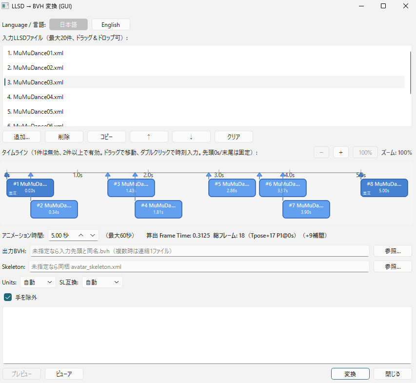
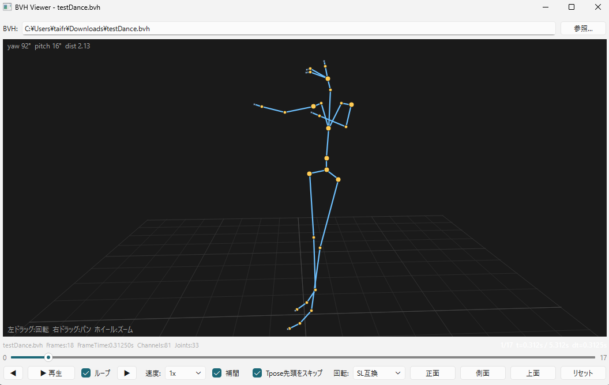

# LLSD2BVH

[日本語版はこちら](README.md).

*Translated from `README.md` at `9e804f7` (2026-09-29).*

A conversion tool that transforms LLSD XML pose files exported from the Firestorm/Aperture Viewer Poser into BVH files for Second Life and Blender.

## Prerequisites

- This tool expects difference poses based on the T-pose (`startFromTeePose` assumption. In the viewer, select `Start from T-pose`).
- The face (`mFace*`) and tail (`mTail*`) are excluded by default. The hands (`mHand*`) are included by default (you can toggle them with an option).
- Second Life compatibility has priority, but generic Blender output is also available (switch with `--units` / `--sl-compat`).

## Overview

This tool reads LLSD XML exported by the Firestorm/Aperture Viewer Poser (`rotation` values are roll/pitch/yaw Euler angles in radians) and converts the data into BVH `HIERARCHY` + `MOTION`.

- **Only Firestorm/Aperture viewers are supported. Other viewers are untested** (the tool depends on the LLSD `getEulerAngles` behavior).
- You can arrange up to 100 poses with drag and drop, not only a single pose. Specify the timing of each pose on the timeline (horizontal axis) and export the poses as concatenated BVH files (new in v0.4.0). Masters longer than 60 seconds are automatically split into 60-second-or-less files.
- The animation length is 0.1 to 600 seconds (master length. Anything beyond the 60-second single-file Second Life limit is split automatically). With 2 poses, `Frame Time` equals the animation length. With 3 or more poses at uneven intervals, the tool calculates a uniform `Frame Time` from the minimum interval. It automatically inserts additional frames with Slerp interpolation to fill gaps (minimum `Frame Time` is `0.01`).
- Regardless of position data, the tool prepends one base frame (T-pose) to every output (minimum 2 frames total. The old rotation-only `Frames: 1` output is discontinued). Units keep the existing auto detection (`inch` with position, `meter` without). You can override units explicitly.
- The tool applies viewer-verified per-joint rotation fixes (`BVH(Z,X,Y) = (VX,VY,VZ)`) and pelvis position conversion (`X=VY, Y=VZ, Z=VX`). The orientation and movement match when you upload the file in the viewer.

## Usage: GUI (Recommended)

Switch the application language to English with `Language: English` at the top of the main window. The following names use English UI names (`i18n.py` `en`).

### Download, Extract, and Run

1. Download `LLSD2BVH_vX.Y.Z.zip` (for example, `LLSD2BVH_v0.4.0.zip`) from [GitHub Releases](https://github.com/taifrog/LLSD2BVH/releases).
2. Right-click the file and select `Extract All` to extract it (this creates an `LLSD2BVH/` folder).
3. Double-click `LLSD2BVH/LLSD2BVH.exe` to launch the tool.

> On the first launch, SmartScreen shows `Windows protected your PC`. Click `More info` and then `Run anyway`. This message appears only on the first launch. It appears because the binary has no code signature, and it does not affect functionality.

If you have a Python environment, you can launch the tool without the `exe` file:

```bash
pip install -r requirements.txt  # PySide6
python -m llsd2bvh.gui
# or
llsd2bvh-gui
```

### Screen Layout

#### Main Window



| Area | Description |
|------|------|
| ① Input list | Shows the list of LLSD XML files. Add up to 100 files with drag and drop or `Add…`. Edit the list with `Remove`, `↑`, `↓`, `Clear`, and `Copy`. Use this list to manage files. The output order follows the timeline order. |
| ② Timeline | Shows the horizontal time axis (0 to animation length). Each file gets one lane (header shows the file name) with its pose as a block. Red dashed split lines appear every 60 seconds with yellow overlap bands around the boundaries. Drag a block to move its time. Double-click a block to enter a numeric value. The first block is fixed at 0 seconds. The last block is fixed at `duration` (shown in a darker color). The timeline is enabled with 2 or more poses, and disabled with 1 pose. Use `−`/`+`, `100%`, and `Zoom: n%` at the top to zoom from 100% to 400% (in 50% steps). Use the wheel to zoom. Drag an empty area with the left button to pan. With 100 files, the view scrolls vertically. |
| ③ Animation length | Sets the total length of the BVH in seconds. Specify a value from 0.1 to 600.0 seconds (up to 600 seconds of master length. Anything beyond 60 seconds is split automatically). The default is 5.0 seconds. With 2 poses, `Frame Time` equals `duration`. With 3 or more poses at uniform intervals, `Frame Time` equals the minimum interval. With uneven intervals, the tool calculates a uniform `Frame Time` from the minimum interval. It automatically inserts interpolated frames (rotation with `Slerp` and position with `lerp`). The tool clamps the minimum `Frame Time` to 0.01. |
| ④ Calculated Frame Time / Total frames | Shows the `Frame Time` and total frame count calculated from the timeline (for example, `Computed Frame Time: 0.3125 Total: 18 (Tpose+17 P1@0s) (+9 interpolated)`). With uneven intervals, the display shows the interpolated frame count in parentheses. |
| ⑤ Output destination | Sets the output folder. When empty, the tool auto-creates `<first_filename>_split/`. Use `Browse…` to select a folder. File names follow `<basename>_part01.bvh` (2-digit zero padding, auto-expanded to 3 digits beyond 10 parts). |
| ⑥ Skeleton | Sets the path to `avatar_skeleton.xml`. When empty, the tool automatically uses the file built into the `exe` file (`_internal`) or the file next to the `exe` file. To replace the file after a viewer update, place it in the same folder as the `exe` file. |
| ⑦ Units / SL compatible | Sets the output units and Second Life compatibility. `Auto` (recommended) outputs `inch` when a position exists and `meter` otherwise. The base frame (T-pose) is prepended to every output. `Frame Time` is currently hidden and calculated automatically. |
| ⑧ Exclude hands | Toggles the bones to include. Hands are included by default (checkbox OFF). Turn the checkbox ON to exclude hands (the face and tail are always excluded. Only hands are toggleable). |
| ⑨ Progress / Log | Shows the conversion progress and log output. |
| ⑩ Preview / Viewer / Convert / Close | `Preview` shows the output BVH as a 3D stick figure (enabled after conversion). `Viewer` shows any BVH file in 3D (no conversion required, always enabled. Open it empty and select a file with `Browse…` in the viewer window or with drag and drop). Click `Convert` to run the conversion. When conversion finishes, a dialog shows the output path and frame count. |
| ⑪ Overlap / Loop / Split summary | Sets the overlap length at part boundaries from 0.0 to 5.0 seconds (default 2.0, in 0.1 steps). Turn `Loop` ON to auto-append the overlap portion of the first poses at the end (default OFF). The summary row shows the split layout (for example, `Split: 3 files (60.0s/60.0s/34.0s) overlap 2.0s`). |
| ⑫ Part switching | Use the `Part:` dropdown to switch part01 to N and show each part in the existing viewer (enabled after conversion). |

#### BVH Viewer



| Area | Description |
|------|------|
| ① BVH selection | Shows a row as `BVH: … Browse…` at the top. Open the viewer from `Preview` / `Viewer` in the main window, or launch it standalone with `python -m llsd2bvh.viewer` / `bvh-viewer`. You can also load a file with drag and drop. |
| ② 3D view | Shows a 3D stick figure (bone lines and joint points) with a floor grid. Drag with the left button to rotate, drag with the right button to pan, and use the wheel to zoom. The top left shows `yaw/pitch/dist`, and the bottom right shows operation hints. |
| ③ Information row | Shows the file name, `Frames/FrameTime/Channels/Joints`, and `f/t/dt`. With interpolation ON, the viewer displays inter-frame states at 30 fps, for example `1->2 (50%) f=1.50 [Interpolated]`. |
| ④ Slider | Drag the slider from `0` to `Frames-1`, or move one frame with `◀` / `▶`. During playback, only the integer part is synchronized. |
| ⑤ Playback controls | Includes `◀`, `▶ Play` / `⏸ Pause`, `Loop`, `▶`, `Speed (0.25x-2x)`, `Interp` (ON by default for smooth 30 fps playback with channel `lerp` and shortest-angle wrap (`wrap`), OFF for frame-by-frame stepping), `Skip Tpose`, and `Rotation (SL compat / BVH standard)`. |
| ⑥ View presets | Includes `Front (180°)` / `Side (90°)` / `Top (85°)` / `Reset (180°/0°)`. After any rotation, use `Reset` to return to the initial viewpoint. |

### Basic Workflow

1. Create a pose in the Firestorm/Aperture Poser and export it as LLSD XML.
   - Always set the T-pose before you start posing (only modified parts are saved).
   - To export the file, click `My Poses` at the bottom right. Name the pose in the area on the right side, and click `Save Pose` to save it.
   - To locate the exported file, open `Preferences`, then `Setup` and `Directories` in this order. Click `Open Settings Folder`. The file is in the `poses` folder inside it.
2. Add XML files to the input list in the GUI with drag and drop (or `Add…`). The list keeps the files, and the tool automatically places them on the horizontal timeline.
   - With 1 pose: the timeline is disabled. The tool prepends the base frame (T-pose) and outputs a 2-frame BVH file.
   - With 2 poses: the tool places them at both ends of the timeline (0 seconds and `duration`). It prepends the base frame and outputs the result.
   - With 3 or more poses: drag each block to move its time, and double-click it to enter a numeric value. Specify the animation length from 0.1 to 600 seconds. With uniform intervals, the tool outputs the frames as-is. With uneven intervals, it calculates a uniform `Frame Time` from the minimum interval. It automatically inserts interpolated frames with `Slerp` (rotation) and `lerp` (position) and outputs the result.
3. Adjust the timing of each pose on the timeline and check the animation length (the tool shows the calculated `Frame Time` and total frame count). Use `−` / `+` or the wheel to zoom in for fine editing. Set the overlap length and the loop option, and check the part layout in the summary row.
4. Change the output folder or Units / SL compatibility as needed (normally keep `Auto`).
5. Click `Convert`. When the log shows per-part `written` lines, the conversion succeeded. Load the output `.bvh` files in the viewer or Blender.
6. After conversion, check the result with `Preview`. To check any BVH file without conversion, use `Viewer` to show a 3D stick figure (it plays smoothly at 30 fps with interpolation ON. Switch the viewpoint with `Front` / `Side` / `Top` / `Reset`).

## Usage: CLI (Command Line)

### Commands

```bash
# Single file
python -m llsd2bvh input.xml -o output.bvh
# or after installation
llsd2bvh input.xml -o output.bvh

# Explicitly set inch / 2 frames for Second Life upload
python -m llsd2bvh input.xml --units inch --sl-compat -o output_sl.bvh

# Output multiple files separately into a directory
python -m llsd2bvh poses/*.xml -o out_dir/

# Specify a directory (all *.xml files at once)
python -m llsd2bvh poses/ -o out_dir/

# Wildcards (also work in shells without glob expansion)
python -m llsd2bvh "poses/*.xml" -o out_dir/

# Concatenate and auto-split (150-second master into three 60-second-or-less files)
python -m llsd2bvh poses/*.xml --concat --total-duration 150 --overlap 2.0 -o split_out/

# Concatenate and split with loop closure
python -m llsd2bvh poses/*.xml --concat --total-duration 120 --overlap 2.0 --loop -o split_out/
```

> The GUI version concatenates multiple inputs and auto-splits them into multiple BVH files. The CLI version outputs multiple inputs as separate BVH files by default (`--concat` gives the GUI-equivalent concatenate-and-split behavior).

### Options

| Option | Description | Default |
|------------|------|--------|
| `inputs` | Input LLSD XML files (multiple allowed, wildcards and directories allowed) | Required |
| `-o, --output` | Output BVH path. Specify a directory for multiple inputs | When empty, a `.bvh` file with the same name as the input |
| `--skeleton` | Path to `avatar_skeleton.xml` | Auto-detected (`exe` folder / `_internal` / `CWD` / repository root / viewer default path) |
| `--units {meter,inch}` | Output units | `Auto`: `inch` with position, `meter` without position. An explicit value overrides auto detection |
| `--sl-compat` | Second Life compatibility (currently accepted only. Outputs always carry the base frame, so the flag has no effect) | - |
| `--no-sl-compat` | Disable Second Life compatibility (currently accepted only. Outputs always carry the base frame, so the flag has no effect) | - |
| `--frame-time FLOAT` | Frame Time | `0.0333333` |
| `--include-face` | Include face bones (`mFace*`) | Excluded |
| `--include-tail` | Include tail bones (`mTail*`) | Excluded |
| `--no-hands` | Exclude hand bones (`mHand*`) | Included |
| `--total-duration FLOAT` | Master length in seconds for concatenation (`--concat` only) | `5.0` |
| `--max-split FLOAT` | Maximum seconds per part (fixed at 60 for now) | `60.0` |
| `--overlap FLOAT` | Overlap length in seconds at part boundaries | `2.0` |
| `--loop` | Loop closure: append the first poses at the end | OFF |
| `--concat` | Concatenate inputs and auto-split into multiple BVH files | OFF (separate outputs) |
| `-h, --help` | Show help | - |

```bash
python -m llsd2bvh --help
```

## Specifications

### How It Works

- **Hierarchy**: The tool reads `OFFSET` values and parent-child relations from `avatar_skeleton.xml` (bundled from `C:\Program Files\SecondLifeViewer\character\avatar_skeleton.xml`). It builds `HIERARCHY` with the normalized `BVH_HIERARCHY` (26 joints and fingers with `mPelvis` as ROOT). It converts units from `meter` to `inch` by multiplying by 39.37008.
- **Rotation**: The tool reads LLSD `rotation` values directly as roll (VX) / pitch (VY) / yaw (VZ) in radians from `LLQuaternion.getEulerAngles`. It converts the values to degrees and outputs them as BVH `Zrotation Xrotation Yrotation` (ZXY order). It applies the viewer-verified per-joint fix `BVH(Z,X,Y) = (VX,VY,VZ)` to `mHead/mNeck/mChest/mTorso/mCollar/mShoulder/mElbow/mWrist/mHip/mKnee/mAnkle/mPelvis` (17 joints).
- **Position**: The tool uses only the `mPelvis` `position` value. It applies the viewer BVH axis swap `Xpos=VY, Ypos=VZ, Zpos=VX` with `inch` conversion. Every output carries one base frame (T-pose) at the start.
- **Filter**: `skeleton.py:filter_skeleton` keeps only `support=="base"` by default. You can toggle `mFace*` / `mTail*` / `mHand*` with options.
- **Timeline**: `timeline.py:compute_timeline_frames` forces `t0=0, t_last=duration`. With uniform intervals, the tool outputs the frames as-is. With uneven intervals, it calculates a uniform interval with `dt = duration / (ceil(duration/min_gap)+1)`. It interpolates grid points `t=i*dt` between surrounding keyframes with `Slerp` (rotation as `Quaternion`, position with `lerp`). With 2 poses, `dt=duration`. The timeline is disabled with 1 pose.
- **Long animation split**: `timeline.py:split_frames` auto-splits a master (up to 600 seconds) into parts of 60 seconds or less (`S_0=0`, `E_i=S_i+60`, `S_{i+1}=E_i-overlap`). Frames in the overlap zone are duplicated into both parts (no re-interpolation). With looping, `loop_closure_frames` appends the overlap portion of the first poses at the end. Parts without new grid points are dropped. Sparse timelines (`dt` coarser than the overlap) produce a warning.

### How to Build

```powershell
# Dependencies
pip install pyinstaller PySide6

# onedir build (recommended: folder distribution, about 110MB)
powershell -ExecutionPolicy Bypass -File tools/build_exe.ps1
# Output: dist/LLSD2BVH/LLSD2BVH.exe + _internal/ + avatar_skeleton.xml
#         dist/LLSD2BVH_vX.Y.Z.zip (for example, about 44MB)

# Entry: tools/entry_gui.py is a wrapper for relative imports
# spec: LLSD2BVH.spec (windowed/onedir, excludes Qt3D/WebEngine and others)
```

`avatar_skeleton.xml` is built into the `exe` file (`_internal/avatar_skeleton.xml`), but you can replace it by placing a file with the same name next to the `exe` file or by specifying it in the Skeleton field in the GUI (priority: explicit specification > next to `exe` > `_internal` > `CWD`).

### Development

```bash
pip install -r requirements.txt
pytest -q
```

### Sequential Playback in Second Life (LSL Timer Guide)

- Each part is an independent BVH file of 60 seconds or less. In-world, play them one after another with a timer. A good switching interval is `part length − overlap` (for example, with a 60-second part and a 2-second overlap, call `llStartAnimation` for the next part after 58 seconds and `llStopAnimation` for the old one).
- For loop playback, play through the closure-appended final part, then return to the start. LSL scripts themselves are not part of this tool.
