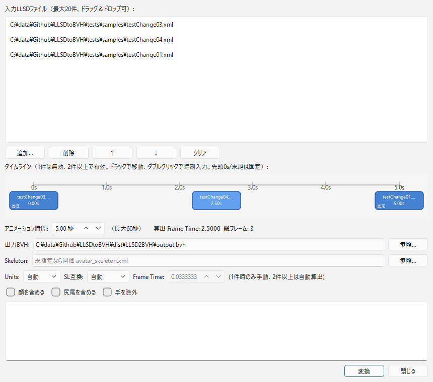

# LLSDtoBVH

Firestorm / Aperture Viewer の Poser でエクスポートした LLSD XML ポーズファイルから、Second Life / Blender 用 BVH への変換ツール。

## 前提

- Tポーズを基準とした差分ポーズを想定（`startFromTeePose` 前提。Viewer側で「Tポーズから開始」にチェック）
- 顔 (`mFace*`) と Tail (`mTail*`) はデフォルトで除外、手 (`mHand*`) は含む（オプションで切替可）
- Second Life 互換を優先しつつ Blender 汎用出力も可能（`--units` / `--sl-compat` で切替）

## 概要

本ツールは Firestorm / Aperture Viewer の Poser が出力する LLSD XML（`rotation` が roll/pitch/yaw の Euler rad）を読み取り、BVH の `HIERARCHY` + `MOTION` に変換します。

- **対応ビューワは Firestorm / Aperture のみ、他ビューワは未確認**です（LLSDの `getEulerAngles` 仕様に依存）。
- 単一ポーズだけでなく、最大20件のポーズをドラッグ＆ドロップで並べ、タイムライン（横）で各ポーズの実行タイミングを指定して1つのBVHに連結出力できます（`timeline` ブランチの新機能）。
- アニメーション時間は 0.1〜60秒（SL制限）で指定。2件時は Frame Time = 時間、3件以上で間隔が不均一な場合は最小間隔から均一な Frame Time を算出し間に Slerp補間で追加フレームを自動挿入します（最低 Frame Time 0.01）。
- 位置（`mPelvis`）がある場合は自動で `inch` + SL互換 `Frames:2`（基準フレーム複製）、回転のみの場合は `meter` + `Frames:1` で出力します（明示的に上書きも可）。
- Viewer 検証済みの per-joint 回転 fix（`BVH(Z,X,Y)=(VX,VY,VZ)`）と Pelvis 位置 `X=VY,Y=VZ,Z=VX` 変換を適用し、Viewerアップロード時の向き・移動が一致します。

## 使い方 — GUI版（推奨）

### ダウンロード・解凍・実行

1. [GitHub Releases](https://github.com/taifrog/LLSD2BVH/releases) から `LLSD2BVH_v0.1.0.zip` をダウンロード
2. 右クリック →「すべて展開」で解凍（`LLSD2BVH/` フォルダが生成されます）
3. `LLSD2BVH/LLSD2BVH.exe` をダブルクリックで起動

> 初回起動時に SmartScreen「Windows によって PC が保護されました」と表示された場合は「詳細情報」→「実行」をクリックしてください。2回目以降は表示されません。コード署名なしのため表示されるだけで機能に影響はありません。

Python 環境がある場合は exe なしでも起動できます:

```bash
pip install -r requirements.txt  # PySide6
python -m llsd2bvh.gui
# または
llsd2bvh-gui
```

### 画面の説明



| 部位 | 説明 |
|------|------|
| ① 入力リスト | LLSD XML の一覧。ドラッグ＆ドロップ、または「追加…」で最大20件まで追加。選択して「削除」「↑」「↓」「クリア」で編集。リストはファイル管理用、出力順はタイムラインの時刻順になります |
| ② タイムライン | 横方向の時間軸（0〜アニメーション時間）。各ポーズをブロックで表示、ドラッグで時刻を移動、ダブルクリックで数値入力。先頭ブロックは0s、末尾は duration に固定（濃色で表示）。2件以上で有効、1件時は無効 |
| ③ アニメーション時間 | BVH全体の秒数。0.1〜60.0秒（SL制限により最大60秒）、既定5.0秒。2件時は Frame Time = duration、3件以上で均一なら Frame Time = 最小間隔、不均一なら最小間隔から均一な Frame Time を算出し間に補間フレーム（Slerp＋位置lerp）を自動挿入。最低 Frame Time 0.01でクランプ |
| ④ 算出 Frame Time / 総フレーム | タイムラインから自動算出された Frame Time と総フレーム数を表示（例: `算出 Frame Time: 1.0000  総フレーム: 6（+3補間）`） |
| ⑤ 出力BVH | 出力先。未指定なら1件時は入力と同名 `.bvh`、複数時はタイムライン先頭のファイル名 `_concatenated.bvh` に出力。「参照…」で任意のパスを指定可 |
| ⑥ Skeleton | `avatar_skeleton.xml` のパス。未指定なら exe 内蔵（`_internal`）または exe 横のファイルを自動で使用。Viewer更新時に差し替える場合は exe と同じフォルダに置いてください |
| ⑦ Units | 出力単位。`自動`（推奨）は位置あり→`inch`、位置なし→`meter`。SLアップロードは `inch` |
| ⑦ SL互換 | `自動`（推奨）は位置あり→`2フレーム`（先頭に基準フレームを複製）、位置なし→`1フレーム` |
| ⑦ Frame Time | 1件時のみ手動で有効（既定 `0.0333333`）。2件以上はタイムラインから自動算出され無効化 |
| ⑧ 顔/尻尾/手 | 含めるボーンの切替。既定は顔・尻尾除外、手は含む |
| ⑨ Progress/Log | 変換進捗とログ表示 |
| ⑩ 変換/閉じる | 「変換」で実行、完了時にダイアログで出力パスとフレーム数を表示 |

### 基本的な使い方

1. Firestorm/Aperture の Poser でポーズを作成し、LLSD XML としてエクスポート
   - ※必ずTポーズにセットを実行しポージングしてください（変更した箇所だけ保存されるため）
   - ※エクスポート方法は、右下「自分のポーズ」をクリック、右側に表示されるエリアに名前をつけて、「ポーズを保存」をクリックで保存されます
   - ※エクスポートしたファイルの場所は、初期設定 > セットアップ > ディレクトリ >「設定フォルダを開く」クリック、その中の `poses` フォルダにあります
2. GUI の入力リストに XML をドラッグ＆ドロップ（または「追加…」）で追加。リストはそのまま残し、タイムライン（横）へ自動配置されます
   - 1件の場合: タイムラインは無効、Frame Time を直接指定して1フレームBVHとして出力
   - 2件の場合: タイムラインの両端（0s と duration）に配置、Frame Time = アニメーション時間として2フレームBVHを出力
   - 3件以上: 各ブロックをドラッグで時刻を移動、ダブルクリックで数値入力。アニメーション時間を 0.1〜60秒で指定。間隔が均一ならそのまま、非均一なら最小間隔から均一な Frame Time を算出し間に Slerp（回転）＋lerp（位置）で補間フレームを自動挿入して出力
3. タイムラインでポーズのタイミングを調整し、アニメーション時間を確認（算出 Frame Time と総フレーム数が表示されます）
4. 必要に応じて出力先や Units/SL互換を変更（通常は `自動` のままでOK）
5. 「変換」をクリック → ログに `書き出し完了` と表示されれば成功。出力された `.bvh` を Viewer や Blender で読み込んでください

## 使い方 — CUI版

### コマンド

```bash
# 単一ファイル
python -m llsd2bvh input.xml -o output.bvh
# またはインストール後
llsd2bvh input.xml -o output.bvh

# SLアップロード用に明示的に inch/2フレーム
python -m llsd2bvh input.xml --units inch --sl-compat -o output_sl.bvh

# 複数ファイルをディレクトリに個別出力
python -m llsd2bvh poses/*.xml -o out_dir/

# ディレクトリ指定（*.xml を一括）
python -m llsd2bvh poses/ -o out_dir/

# ワイルドカード（シェル展開されない環境でもOK）
python -m llsd2bvh "poses/*.xml" -o out_dir/
```

> GUI版は複数入力を1つのBVHに連結しますが、CUI版は複数入力を個別のBVHに分割出力します。連結が必要な場合はGUI版を使用してください。

### オプション

| オプション | 説明 | 既定値 |
|------------|------|--------|
| `inputs` | 入力 LLSD XML（複数可、ワイルドカード/ディレクトリ可） | 必須 |
| `-o, --output` | 出力 BVH パス。複数入力時はディレクトリ | 未指定時は入力と同名 `.bvh` |
| `--skeleton` | `avatar_skeleton.xml` のパス | 自動探索（exe横/_internal/CWD/リポジトリ直下/Viewer既定パス） |
| `--units {meter,inch}` | 出力単位 | `自動`: 位置あり→`inch`、位置なし→`meter`。明示時は上書き |
| `--sl-compat` | SL互換: 先頭に基準フレームを複製（`Frames:2`） | `自動`: 位置あり→有効、位置なし→無効 |
| `--no-sl-compat` | SL互換を無効化（自動判定を上書き） | - |
| `--frame-time FLOAT` | Frame Time | `0.0333333` |
| `--include-face` | 顔ボーン (`mFace*`) を含める | 除外 |
| `--include-tail` | Tailボーン (`mTail*`) を含める | 除外 |
| `--no-hands` | 手ボーン (`mHand*`) を除外 | 含む |
| `-h, --help` | ヘルプ表示 | - |

```bash
python -m llsd2bvh --help
```

## 本ツールについて

### 仕組み

- **階層**: `avatar_skeleton.xml`（`C:\Program Files\SecondLifeViewer\character\avatar_skeleton.xml` を同梱）から `OFFSET` と親子関係を取得し、正規化した `BVH_HIERARCHY`（`mPelvis` を ROOT とする26+手指）で `HIERARCHY` を構築。単位は `meter`→`inch` で 39.37008 倍。
- **回転**: LLSD `rotation` は `LLQuaternion.getEulerAngles` の roll(VX)/pitch(VY)/yaw(VZ) [rad] をそのまま読み、度数変換して BVH `Zrotation Xrotation Yrotation`（ZXY順）へ出力。Viewer検証済みの per-joint fix `BVH(Z,X,Y)=(VX,VY,VZ)` を `mHead/mNeck/mChest/mTorso/mCollar/mShoulder/mElbow/mWrist/mHip/mKnee/mAnkle/mPelvis`（17joint）に適用。
- **位置**: `mPelvis` の `position` のみを使用。Viewer BVH の `Xpos=VY, Ypos=VZ, Zpos=VX` 入替と `inch` 変換を適用。位置があれば `Frames:2`（先頭にゼロフレームを挿入）でSLアップロードのテレポートを防止。
- **フィルタ**: `skeleton.py:filter_skeleton` で `support=="base"` のみを既定とし、`mFace*`/`mTail*`/`mHand*` はオプションで切替。
- **タイムライン**: `timeline.py:compute_timeline_frames` で `t0=0, t_last=duration` を強制、均一ならそのまま、不均一なら `dt = duration / (ceil(duration/min_gap)+1)` で均一化し、格子点 `t=i*dt` を前後のキーフレーム間で Slerp（回転は Quaternion、位置は lerp）補間。2件時は `dt=duration`、1件時はタイムライン無効。

### ビルド方法

```powershell
# 依存関係
pip install pyinstaller PySide6

# onedir ビルド（推奨: フォルダ配布, 約110MB）
powershell -ExecutionPolicy Bypass -File tools/build_exe.ps1
# 出力: dist/LLSD2BVH/LLSD2BVH.exe + _internal/ + avatar_skeleton.xml
#       dist/LLSD2BVH_v0.1.0.zip (約44MB)

# エントリ: tools/entry_gui.py が相対import対策のラッパー
# spec: LLSD2BVH.spec（windowed/onedir, excludesでQt3D/WebEngine等を除外）
```

`avatar_skeleton.xml` は exe に内蔵（`_internal/avatar_skeleton.xml`）されていますが、exe と同じフォルダに同名ファイルを置くか、GUIの Skeleton 欄で明示指定することで差し替え可能です（優先順位: 明示指定 > exe横 > _internal > CWD）。

### 開発

```bash
pip install -r requirements.txt
pytest -q  # 10 tests
```
